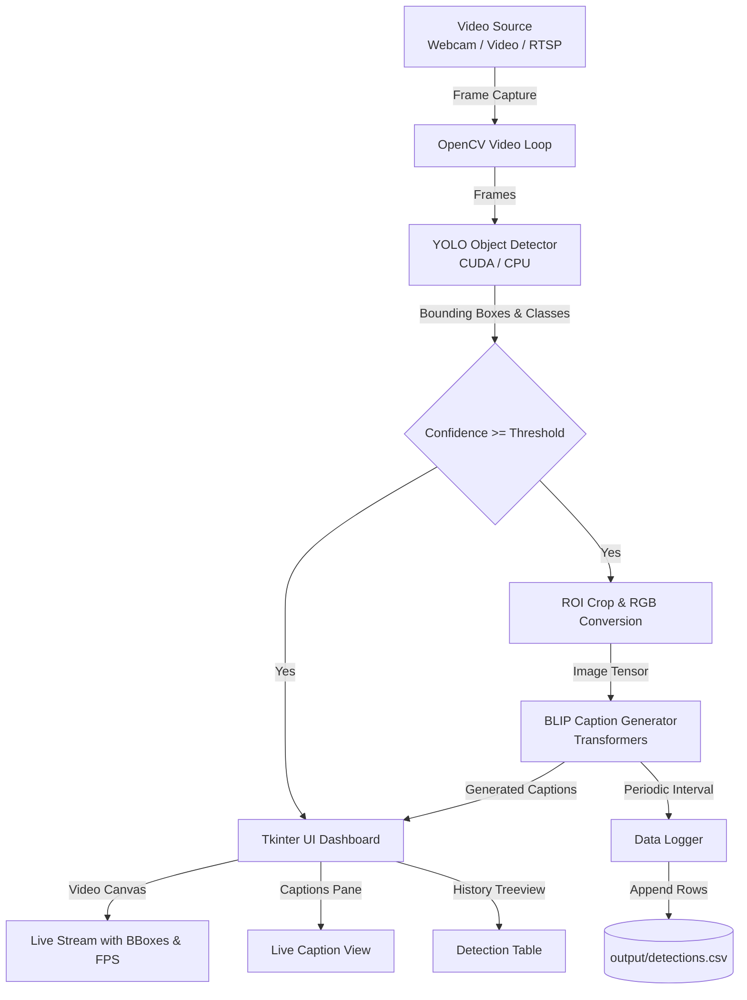

# 🎥 Vision-Based CCTV Object Detection & Logging System

[](https://www.python.org/)
[](https://pytorch.org/)
[](https://github.com/ultralytics/ultralytics)
[](https://huggingface.co/docs/transformers/model_doc/blip)
[](https://github.com/astral-sh/uv)

An intelligent, real-time vision surveillance and monitoring application. The system combines **YOLO** for ultra-fast object detection, **BLIP (Bootstrapped Language-Image Pretraining)** for rich contextual image captioning of detected regions of interest (ROI), an interactive **Tkinter GUI**, and a background **CSV data logger**.

---

## 🌟 Key Features

- **⚡ Real-Time Object Detection**: Detects multiple classes with high accuracy using YOLO models (`yolov26n.pt` / `yolov8n.pt`), with automatic CUDA GPU acceleration and CPU fallback.
- **📝 Intelligent Contextual Captioning**: Extracts bounding box regions of interest (ROI) and generates natural language captions on-the-fly using the BLIP model via Hugging Face Transformers.
- **🖥️ Responsive Multi-Pane Desktop Dashboard**:
  - **Live Video Feed**: Canvas rendering bounding boxes, object tags, confidence scores, and real-time FPS counter.
  - **Live Captions Pane**: Dedicated real-time display showing latest generated descriptions for detected objects.
  - **Detection Log Table**: Interactive scrollable Treeview widget recording detection events with timestamps.
  - **Status Bar**: Real-time status notifications for model initialization and video feed states.
- **📊 Automated CSV Data Logging**: Logs detection timestamp (millisecond precision), object category, and generated caption into `output/detections.csv`.
- **⚙️ Configurable Performance Pipeline**:
  - Configurable video input source (Webcam, local `.mp4` video files, RTSP network streams).
  - Rate-limited logging (`LOG_INTERVAL_SECONDS`) to avoid duplicate spam.
  - Frame-interval caption caching (`CAPTION_INTERVAL_FRAMES`) to sustain high framerates.

---

## 🏗️ System Architecture



---

## 📁 Project Structure

```
Vision-Based CCTV Object Detection & Logging System/
├── output/
│   └── detections.csv          # Generated CSV logs with timestamps and captions
├── src/
│   └── ai_based_cctv/
│       └── __init__.py         # Package entry module
├── caption_generator.py        # BLIP image captioning pipeline
├── data_logger.py              # Thread-safe CSV logging utility
├── main.py                     # Main application entry point & Tkinter GUI
├── object_detector.py          # YOLO object detector wrapper (CUDA/CPU)
├── pyproject.toml              # Project configuration and dependency specifications
├── readme.md                   # Project documentation
├── uv.lock                     # UV dependency lockfile
└── yolov26n.pt                 # Pre-trained YOLO model weights
```

---

## 🛠️ Technologies Used

| Category | Technology / Library |
| :--- | :--- |
| **Object Detection** | [Ultralytics YOLO](https://github.com/ultralytics/ultralytics) |
| **Vision-Language Captioning** | [BLIP (Salesforce / Hugging Face Transformers)](https://huggingface.co/docs/transformers/model_doc/blip) |
| **Deep Learning Framework** | [PyTorch](https://pytorch.org/) (with CUDA 11.8 support) |
| **Computer Vision** | [OpenCV (opencv-python)](https://opencv.org/), [Pillow (PIL)](https://python-pillow.org/) |
| **GUI Framework** | [Tkinter / ttk](https://docs.python.org/3/library/tkinter.html) |
| **Data & Metrics** | [Pandas](https://pandas.pydata.org/), [NumPy](https://numpy.org/), [Supervision](https://github.com/roboflow/supervision) |
| **Package Manager** | [Astral uv](https://github.com/astral-sh/uv) / pip |

---

## 🚀 Getting Started

### Prerequisites

- **Python**: Version `3.10` or `3.11`
- **NVIDIA GPU & CUDA 11.8+** *(Optional, recommended for faster inference)*

### Installation

#### Option 1: Using `uv` (Recommended - Fast & Deterministic)

1. Clone the repository:
   ```bash
   git clone https://github.com/RAPTOR-sr/Vision-Based-CCTV-Object-Detection---Logging-System.git
   cd "Vision-Based CCTV Object Detection & Logging System"
   ```

2. Install dependencies using `uv`:
   ```bash
   uv sync
   ```

3. Run the application:
   ```bash
   uv run python main.py
   ```

---

#### Option 2: Using standard `pip` & virtual environment

1. Clone the repository:
   ```bash
   git clone https://github.com/RAPTOR-sr/Vision-Based-CCTV-Object-Detection---Logging-System.git
   cd "Vision-Based CCTV Object Detection & Logging System"
   ```

2. Create and activate a virtual environment:
   - **Windows (PowerShell)**:
     ```powershell
     python -m venv .venv
     .venv\Scripts\Activate.ps1
     ```
   - **Linux / macOS**:
     ```bash
     python -m venv .venv
     source .venv/bin/activate
     ```

3. Install dependencies:
   ```bash
   pip install -e .
   ```

4. Run the application:
   ```bash
   python main.py
   ```

---

## ⚙️ Configuration

You can customize the application behavior by modifying the configuration constants in [`main.py`](file:///d:/Projects/Vision-Based%20CCTV%20Object%20Detection%20&%20Logging%20System/main.py#L15-L23):

```python
# --- Configuration ---
VIDEO_SOURCE = 0              # 0 for default webcam, or "path/to/video.mp4", or "rtsp://..."
YOLO_MODEL = 'yolov26n.pt'    # Path to YOLO model weights
CONFIDENCE_THRESHOLD = 0.5    # Minimum confidence score for detections (0.0 to 1.0)
OUTPUT_DIR = 'output'         # Directory to save CSV logs
LOG_FILENAME = 'detections.csv' # Filename for detection log
LOG_INTERVAL_SECONDS = 1.0    # Frequency of writing detection logs to CSV
CAPTION_INTERVAL_FRAMES = 10  # Refresh rate for regenerating BLIP captions per class
# --- Configuration End ---
```

---

## 🖥️ Usage Guide

1. **Start Feed**: Click the **Start Feed** button to initialize the video stream and start the detection & captioning loop.
2. **Monitor**:
   - Inspect the left frame for real-time video, bounding boxes, labels, and FPS.
   - Read descriptive captions in the top-right **Live Captions** pane.
   - Monitor the latest detection history in the bottom-right **Detection Log** table.
3. **Stop Feed**: Click **Stop Feed** to halt video processing and release camera resources cleanly.
4. **View Logs**: Review the saved logs at `output/detections.csv`:
   ```csv
   Timestamp,Category,Caption
   2026-09-07 01:15:30.124,person,a person standing in a room
   2026-09-07 01:15:31.140,cup,a coffee mug on a desk
   ```

---

## 🤝 Contributing

Contributions are welcome! Please follow these steps:

1. Fork the repository.
2. Create your feature branch (`git checkout -b feature/AmazingFeature`).
3. Commit your changes (`git commit -m 'Add some AmazingFeature'`).
4. Push to the branch (`git push origin feature/AmazingFeature`).
5. Open a Pull Request.

---

## 📄 License

Copyright (c) 2025-2026 Shivansh. All rights reserved.

---

## 🙏 Acknowledgments

- [Ultralytics](https://github.com/ultralytics) for the YOLO object detection framework.
- [Salesforce Research](https://github.com/salesforce) & Hugging Face for the BLIP Vision-Language model.
- The open-source community for PyTorch, OpenCV, and modern Python tooling (`uv`).